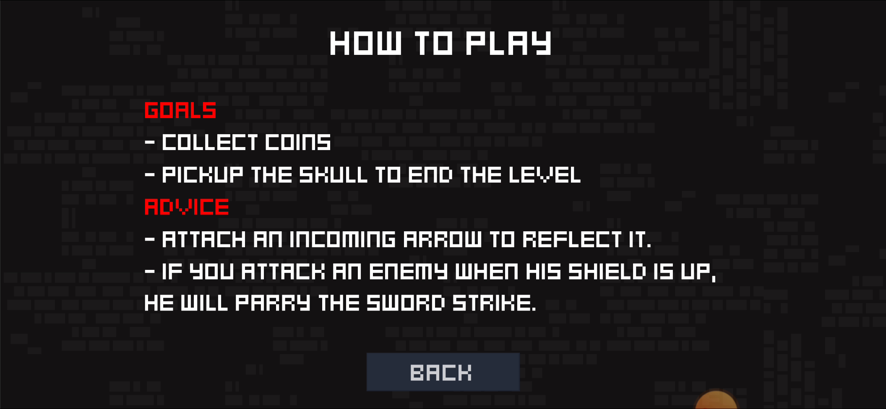
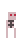
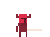
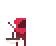
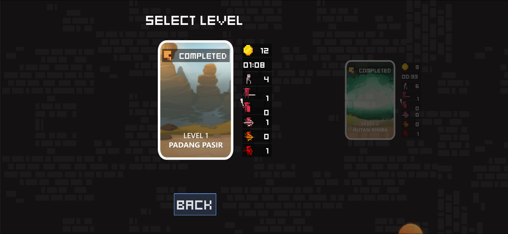
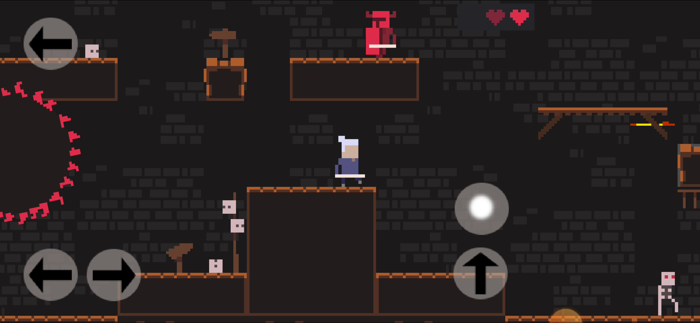
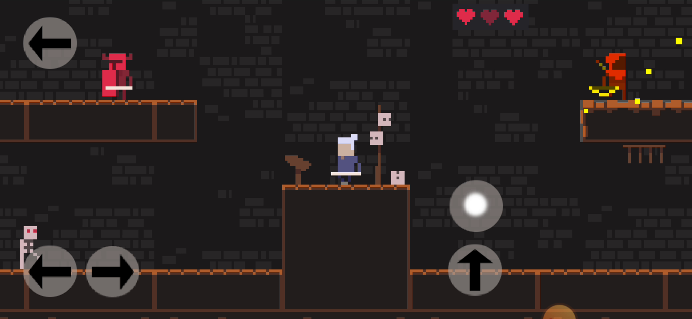
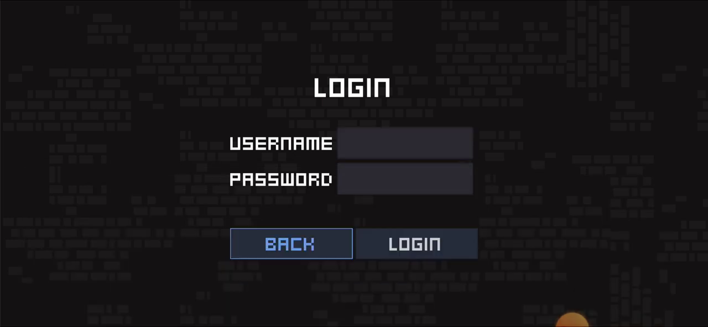
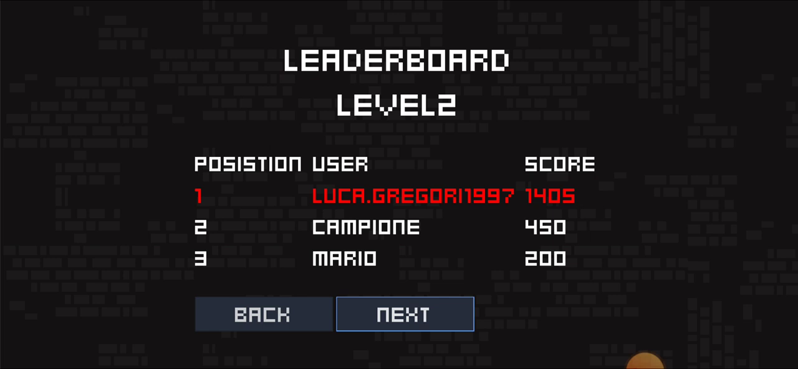
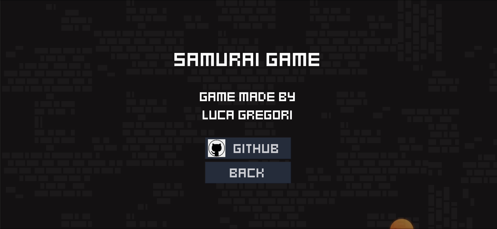

# Samurai Game

**Samurai Game** is an exciting samurai-themed platform game developed for mobile platforms using Godot Engine.

The goal of the game is to complete each level by collecting a skull. Players will encounter obstacles, battle enemies, and collect valuable items along the way, while ensuring they don't run out of lives. There will be multiple enemy classes (a total of 6), each with unique attacks and defenses. One of the protagonist's special abilities is the power to deflect arrows shot by enemies, allowing players to reflect them back and defeat the enemies, but only with precise timing.

The game features two demo levels that provide a glimpse into the challenges players will face in the full game. Additionally, online leaderboard functionality has been incorporated, tracking completion times and collected coins during each level.

Two demo levels have been designed to offer players a preview of the challenges they will encounter in the full game. Furthermore, online features have been implemented to provide a competitive element, allowing players to compete for top rankings based on their completion time and the number of collectibles obtained during each level.

**Samurai Game** was developed and conceived by [Luca Gregori](https://www.linkedin.com/in/l-gregori/) for the [Mobile Computing](https://fmilicchio.bitbucket.io/pages/mobile.html) course at [Roma Tre University](https://ingegneriacivileinformaticatecnologieaeronautiche.uniroma3.it/) (2021/2022).
For more information, please refer to the [References](#references) section.

You can watch a complete gameplay video showcasing all the features of the game at the following [link](https://www.youtube.com/watch?v=1PkdDnxIpIU).

---

## Table of Contents
- [Wiki](#wiki)
    - [Objectives](#objectives)
    - [Tips](#tips)
    - [Enemies](#enemies)
    - [Miscellaneous](#miscellaneous)
    - [Levels](#levels)
    - [Leaderboards](#leaderboards)
- [Installation](#installation)
  - [Setting Up Firebase Environment](#setting-up-firebase-environment)
- [References](#references)

---

## Wiki

In this section, you'll find all the essential information about Samurai Game. From [objectives](#objectives) and [tips](#tips) to details about different [enemies](#enemies) and [other game elements](#others), this wiki serves as a handy guide to navigate through the game's features and challenges.

### Objectives

In Samurai Game, the main objectives are as follows:

| Image               | Objective                                        |
|---------------------|--------------------------------------------------|
|  | Collect scattered coins throughout the level       |
|  | Collect the skull to conclude the level |

### Tips

In the main section of the game, players can access a `HOW TO PLAY` screen that explains the main objectives in a few words and provides some basic tips.

#### Extra advices

> - Execute a melee attack against an incoming arrow to send it back and kill the archer or any enemy in its path.
> - If left undisturbed, the swordsman with a shield will not attack you.

### Enemies

Samurai Game features various enemies with different characteristics:

<table style="width: 100%;">
  <tr>
    <th>Image</th>
    <th>Entity</th>
    <th>Speed</th>
    <th>Attack</th>
    <th>Defense</th>
    <th>Health</th>
    <th>Description</th>
  </tr>
  <tr>
    <td align="center"></td>
    <td align="center"><strong>Skeleton</strong></td>
    <td align="center">Fast</td>
    <td align="center">Melee</td>
    <td align="center">No</td>
    <td align="center">1 HP</td>
    <td>A simple enemy that performs melee attacks.</td>
  </tr>
  <tr>
    <td align="center"></td>
    <td align="center"><strong>Swordsman</strong></td>
    <td align="center">Medium</td>
    <td align="center">Sword</td>
    <td align="center">No</td>
    <td align="center">2 HP</td>
    <td>An enemy that performs attacks with a sword.</td>
  </tr>
  <tr>
    <td align="center"></td>
    <td align="center"><strong>Swordsman with shield</strong></td>
    <td align="center">Slow</td>
    <td align="center">Sword</td>
    <td align="center">Shield</td>
    <td align="center">3 HP</td>
    <td>
      When the player gets close to this enemy, they automatically raise their shield for defense. 
      If you hit the shield, the attack will be blocked, and the enemy will counterattack immediately afterward. 
      If you fail to hit the enemy while the shield is raised, there is a good chance that they will initiate an attack on their own. 
      The probability of the enemy's initiating an attack increases as time passes.
    </td>
  </tr>
  <tr>
    <td align="center"></td>
    <td align="center"><strong>Archer</strong></td>
    <td align="center">Medium</td>
    <td align="center">Bow</td>
    <td align="center">No</td>
    <td align="center">2 HP</td>
    <td>
      As soon as the player enters the archer's line of sight, the archer will shoot an arrow towards them. 
      The arrows can also damage other enemies besides the player.
    </td>
  </tr>
  <tr>
    <td align="center"></td>
    <td align="center"><strong>Yellow Archer</strong></td>
    <td align="center">Medium</td>
    <td align="center">Bow</td>
    <td align="center">No</td>
    <td align="center">2 HP</td>
    <td>Behaves like a regular archer, but shoots 5 consecutive arrows in rapid succession as a single attack.</td>
  </tr>
  <tr>
    <td align="center"></td>
    <td align="center"><strong>Red Archer</strong></td>
    <td align="center">Medium</td>
    <td align="center">Bow</td>
    <td align="center">No</td>
    <td align="center">2 HP</td>
    <td>Behaves like a regular archer, but shoots 3 arrows simultaneously in a single attack.</td>
  </tr>
</table>

### Miscellaneous

Samurai Game also includes various miscellaneous elements:

<table>
   <tr>
    <th>Image</th>
    <th>Description</th>
  </tr>
  <tr>
    <td align="center"></td>
    <td>Circular saw capable of damaging the player.</td>
  </tr>
  <tr>
    <td align="center"></td>
    <td>Spikes capable of damaging the player.</td>
  </tr>
</table>

### Levels

The game offers two levels: a simpler introductory level and a more challenging second level, featuring a final showdown with the formidable `Red Archer`. The first level introduces gameplay mechanics, while the second level tests player's skills with increasing difficulty.

Players can select levels from the level selection screen, where infographics display completion status and performance statistics, including time taken, coins collected, and enemies defeated.

<table style="width: 100%;">
  <tr>
    <td align="center">
      
      
<em>Level selection screen</em>

    </td>
    <td align="center">
      
      
<em>First level</em>

    </td>
  </tr>
  <tr>
    <td align="center">
      
      
<em>Second level</em>

    </td>
  </tr>
</table>

### Leaderboards

After registering and logging into the online section, players have the opportunity to rank themselves on a global leaderboard upon completing each level.

<table style="width: 100%;">
  <tr>
    <td align="center">
      
      
<em>Login screen</em>

    </td>
    <td align="center">
      
      
<em>Leadboard for second level</em>

    </td>
  </tr>
</table>

The score is calculated considering various factors, including:

| Action                      | Points Earned       |
|-----------------------------|---------------------|
| Completing the level        | 300 - time taken    |
| Collecting coins            | +100 per coin       |
| Killing skeletons           | +20 per skeleton    |
| Killing knights             | +50 per knight      |
| Killing shield knights      | +100 per shield knight |
| Killing archers             | +50 per archer      |
| Killing yellow archers      | +100 per yellow archer |
| Killing red archers         | +150 per red archer |

Players can aim to achieve higher scores by completing levels efficiently and defeating more enemies while collecting coins to boost their rankings on the global leaderboard.

---

## Installation
To install ***Samurai Game*** on `android`, navigate within this repository to the `release` section and download the **APK** file.
Copy the **APK** file to your device and before proceeding with the installation, make sure to enable the function: `Install from unknown sources`.

Once the game is installed, navigate to the settings to grant the application read and write permissions to files.
Without this step, it will not be possible to use in-game statistics.

> The game has been tested on Android version 6.0 (Marshmallow). For optimal performance and compatibility, it is recommended to have an Android device running Marshmallow or a more recent version.

### Setting Up Firebase Environment

The provided script `Firebase.gd` is responsible for handling online services using [Firebase](https://firebase.google.com/) in the context of the **Samurai Game**. Firebase is a popular backend platform that provides various services, including real-time databases, authentication, cloud storage, and more.

To use Firebase in your project and make this script work, you need to set up the Firebase environment:

1. **Create a Firebase Project**: Go to the [Firebase Console](https://console.firebase.google.com/) and create a new project if you haven't already.

2. **Enable Authentication**: In the Firebase Console, navigate to "Authentication" and enable the "Email/Password" sign-in method. This will allow users to register and login with their email and password.

3. **Set Up Firestore**: In the Firebase Console, navigate to "Firestore Database" and create a new database. Configure the security rules according to your requirements. Since this script doesn't provide any security rules, make sure to set appropriate rules for your use case.

4. **Get API Key and Project ID**: In the Firebase Console, go to "Project settings" and get the API Key and Project ID. These will be used in the script as `API_KEY` and `PROJECT_ID` respectively.

5. **Update the API Key and Project ID**: Open the `Firebase.gd` script and replace the placeholders `API_KEY` and `PROJECT_ID` with the actual API key and project ID obtained from the Firebase Console.

With these steps completed, the **Samurai Game** should be able to interact with Firebase and perform the specified online services, including user registration, login, data saving, data retrieval (leaderboard and current record score), and deletion.

---

## References

**Samurai Game** was developed and conceived by [Luca Gregori](https://www.linkedin.com/in/l-gregori/).

For the development of the game, the Godot game engine was used. You can find more information about Godot and its features at the [official Godot website](https://godotengine.org/). The version used for developing Samurai Game was ``3.3.4``.

### Used Assets
The game utilizes the following assets:

- **Author:** [Senari Rey](https://senari-rey.itch.io/)
- **License:** CC BY 4.0
- **Available at:** [Pixel Art Platformer Tileset](https://senari-rey.itch.io/pixel-art-platformer-tileset)

### Used Music
The 8-bit music used in Samurai Game is titled `Slave Knight Gael`. You can listen to the music at [this link](https://www.youtube.com/watch?v=JBts5_EPu38).
